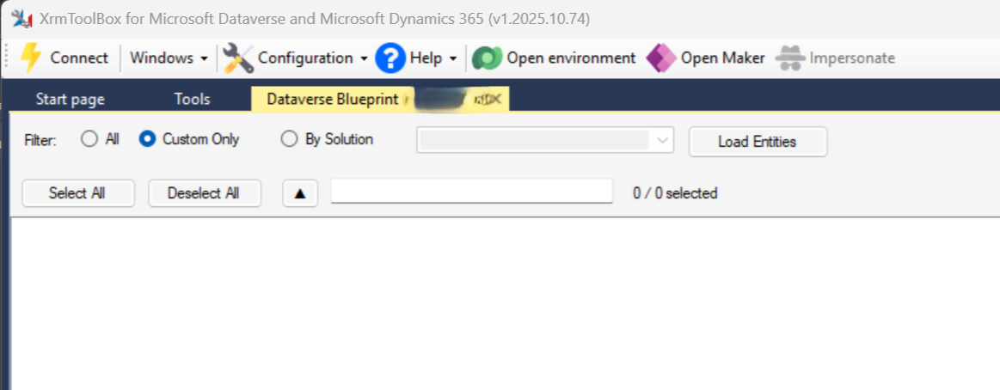
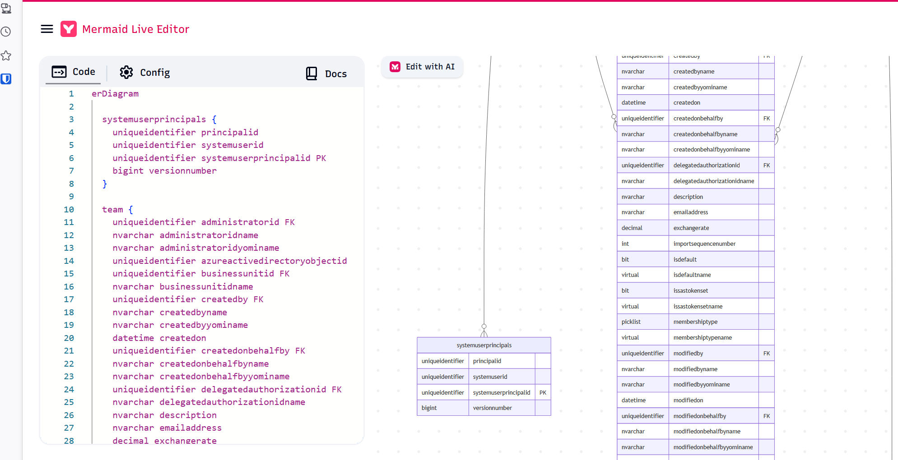
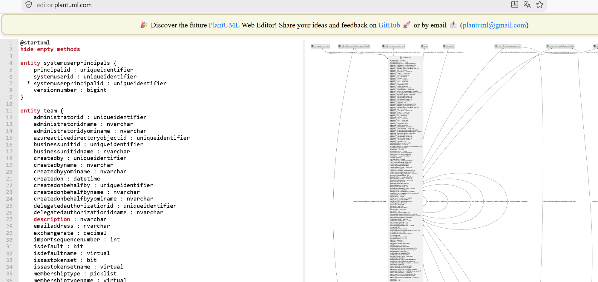
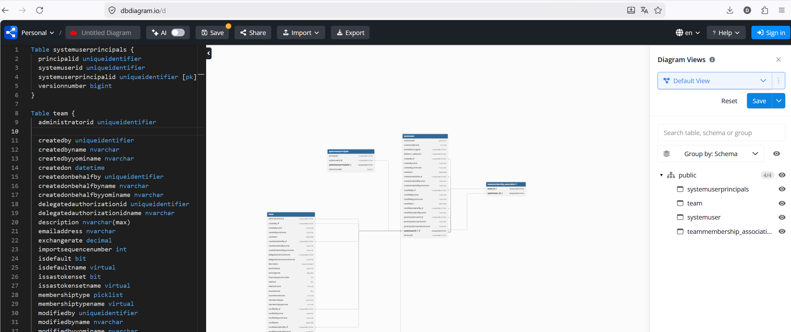

# Dataverse Blueprint

[](https://www.nuget.org/packages/DataverseBlueprint)
[](LICENSE)
[](https://www.xrmtoolbox.com)

An [XrmToolBox](https://www.xrmtoolbox.com) plugin that exports your Microsoft Dataverse entity data model to multiple diagram and documentation formats — so you can visualize, share, and document your schema without writing a single line of code.

---

## What it does

Connect to any Dataverse environment, select the entities you care about, and export the full entity relationship diagram in one click.

| Format | Best for |
|--------|----------|
| **DBML** | [dbdiagram.io](https://dbdiagram.io) — interactive ER diagrams |
| **Mermaid** | GitHub, GitLab, Notion, Confluence, [mermaid.live](https://mermaid.live) |
| **PlantUML** | UML-based documentation pipelines |

---

## Requirements

| Component | Minimum version |
|-----------|-----------------|
| XrmToolBox | 1.2023.x |
| .NET Framework | 4.8 |

---

## Installation

### Via XrmToolBox Tool Library

1. Open XrmToolBox
2. Go to **Tool Library**
3. Search for **Dataverse Blueprint**
4. Click **Install** and restart XrmToolBox

### Manual installation

1. Download `DataverseBlueprint.1.x.x.nupkg` from [GitHub Releases](https://github.com/ejadull/Dataverse-Blueprint/releases)
2. Copy all DLLs from the `Plugins\` folder inside the package to:
   ```
   %APPDATA%\MscrmTools\XrmToolBox\Plugins\
   ```
3. Restart XrmToolBox

---

## Getting started

1. **Connect** to a Dataverse environment using the XrmToolBox connection manager
2. **Choose a filter**
   - *All* — every entity in the environment
   - *Custom Only* — entities with `IsCustomEntity = true`
   - *By Solution* — type the solution unique name
3. Click **Load Entities**
4. Select the entities to include (or use **Select All** / **Deselect All**)
5. Click an **Export as** button and choose a destination file

---

## Export formats in detail

### DBML
Compatible with [dbdiagram.io](https://dbdiagram.io). Each entity becomes a table, each attribute becomes a column, and each relationship becomes a `Ref:` line. Many-to-Many intersect entities are included as junction tables.

### Mermaid
Produces a fenced ` ```mermaid ``` ` block with `erDiagram` syntax. Paste it directly into a GitHub pull request description, a Notion page, or open it in [mermaid.live](https://mermaid.live). Only relationships between the selected entities are emitted, keeping large diagrams clean.

### PlantUML
Produces an `@startuml` / `@enduml` block with entity notation. Primary key attributes are marked with `*`. Works with any [PlantUML](https://www.plantuml.com/plantuml) renderer or CI pipeline integration.

---

## Screenshots

### Plugin in XrmToolBox



---

### Mermaid export

Paste the output directly into GitHub, Notion, or [mermaid.live](https://mermaid.live).



---

### PlantUML export

Compatible with any PlantUML renderer or CI pipeline integration.



---

### DBML export (dbdiagram.io)

Paste the output into [dbdiagram.io](https://dbdiagram.io) for an interactive ER diagram.



---

## Feedback & issues

Open an issue at [github.com/ejadull/Dataverse-Blueprint/issues](https://github.com/ejadull/Dataverse-Blueprint/issues).

---

## License

[MIT](LICENSE) © Edgardo Jadull
